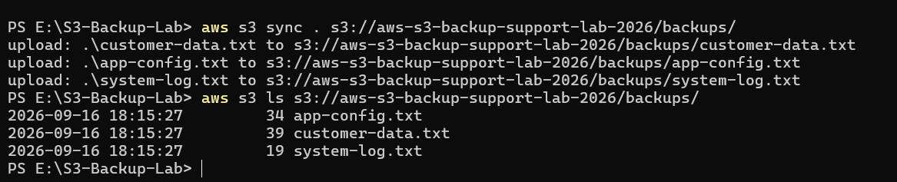
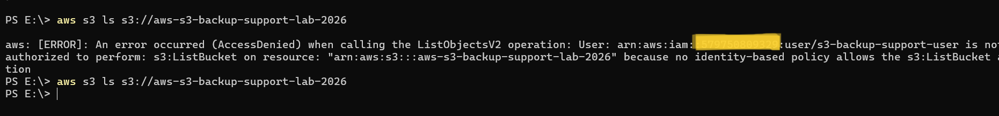
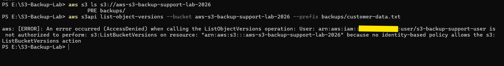
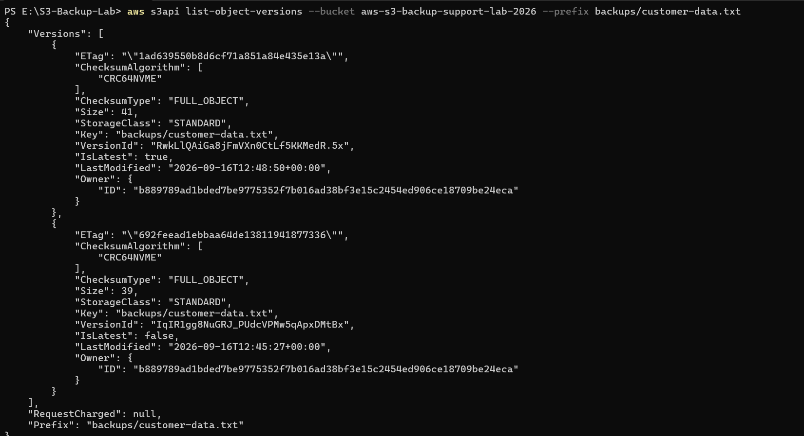
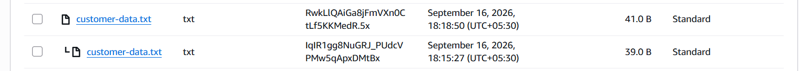
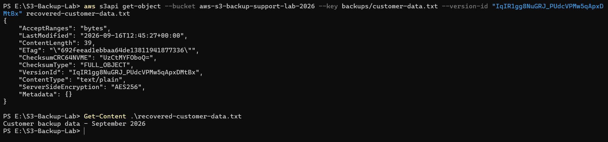
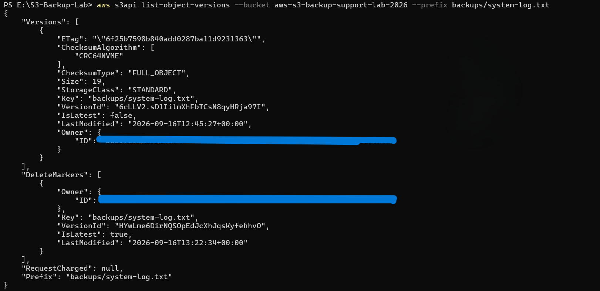
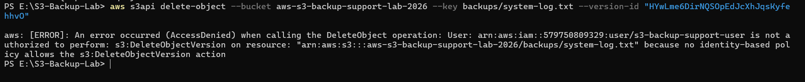
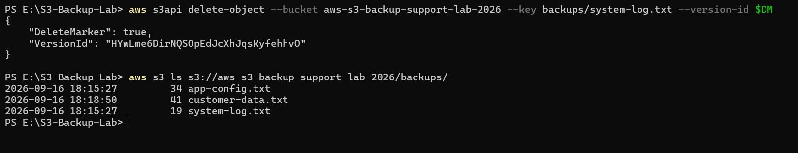

# AWS S3 Backup, Access Control & Troubleshooting

Hands-on AWS S3 project focused on backup operations, IAM least-privilege access, object versioning, recovery, and troubleshooting using the AWS CLI.

## Technologies Used

- Amazon S3
- AWS IAM
- AWS CLI
- S3 Versioning
- PowerShell

## Project Overview

This project simulates common S3 backup and support scenarios. Files were backed up from a local system to Amazon S3 using the AWS CLI, while IAM permissions were configured using least-privilege access.

Multiple troubleshooting scenarios were performed to investigate access-denied errors, object-version permissions, version recovery, and accidental object deletion.

## Backup Operations

Three sample files were created locally:

- `app-config.txt`
- `customer-data.txt`
- `system-log.txt`

The files were uploaded to the S3 bucket using:

```powershell
aws s3 sync . s3://aws-s3-backup-support-lab-2026/backups/
```

S3 Versioning was enabled to maintain previous versions and support recovery.

## IAM Access Control

A dedicated IAM user was used for AWS CLI access.

The custom IAM policy was progressively configured with permissions required for the lab, including:

- `s3:ListBucket`
- `s3:ListBucketVersions`
- `s3:GetObject`
- `s3:GetObjectVersion`
- `s3:PutObject`
- `s3:DeleteObject`
- `s3:DeleteObjectVersion`

Troubleshooting was performed when required permissions were intentionally absent.

## Troubleshooting Scenarios

### Incident 1 — IAM ListBucket Access Denied

A bucket listing failed with `AccessDenied` because the IAM user did not have `s3:ListBucket`.

The missing permission was identified from the AWS CLI error and added to the IAM policy.

[View Incident 1 Documentation](documentation/incident-1-iam-access-denied.md)

### Incident 2 — Object Version Listing Access Denied

Normal bucket listing succeeded, but `list-object-versions` returned `AccessDenied`.

The error identified the missing `s3:ListBucketVersions` permission. After updating the IAM policy, object versions could be listed successfully.

[View Incident 2 Documentation](documentation/incident-2-version-permission.md)

### Incident 3 — Object Version Recovery

`customer-data.txt` was modified and uploaded again, creating multiple object versions.

An older version was identified using its Version ID, downloaded using the AWS CLI, verified locally, and used to demonstrate version-based recovery.

[View Incident 3 Documentation](documentation/incident-3-object-version-recovery.md)

### Incident 4 — Accidental Object Deletion & Recovery

`system-log.txt` was deleted from the version-enabled bucket. Investigation showed that the previous object version still existed and a delete marker had become the latest version.

An initial attempt to remove the delete marker failed because the IAM user lacked `s3:DeleteObjectVersion`. After adding the missing permission, the delete marker was removed and the previous version became visible again.

[View Incident 4 Documentation](documentation/incident-4-deleted-object-recovery.md)

## Project Evidence

### AWS CLI Backup

The local backup files were successfully synchronized to the S3 bucket using the AWS CLI.



### Incident 1 — IAM Access Denied

Bucket access initially failed because the IAM user lacked the `s3:ListBucket` permission.



### Incident 2 — Version Listing Permission Troubleshooting

Listing object versions initially failed because the IAM user lacked `s3:ListBucketVersions`.



After adding the required permission, object versions could be listed successfully.



### Incident 3 — Object Version Recovery

Multiple versions of `customer-data.txt` were created and identified using S3 Versioning.



A previous version was retrieved and verified as part of the recovery process.



### Incident 4 — Deleted Object Recovery

Deleting `system-log.txt` created a delete marker while preserving the previous object version.



The initial recovery attempt failed because the IAM user lacked `s3:DeleteObjectVersion`.



After adding the required IAM permission, the delete marker was removed and `system-log.txt` became visible again.



## Key Learnings

- Performed S3 backup operations using the AWS CLI.
- Applied IAM permissions to a specific S3 bucket and its objects.
- Diagnosed `AccessDenied` errors using AWS CLI error messages.
- Distinguished bucket-level and object-level S3 permissions.
- Worked with S3 object Version IDs and delete markers.
- Recovered previous versions of modified objects.
- Recovered an accidentally deleted object using S3 Versioning.
- Practiced a support workflow of issue identification, root-cause analysis, permission correction, recovery, and verification.

## Project Status

Completed. The project demonstrates AWS S3 backup operations, IAM access-control troubleshooting, object version management, and recovery from modified and accidentally deleted objects.
